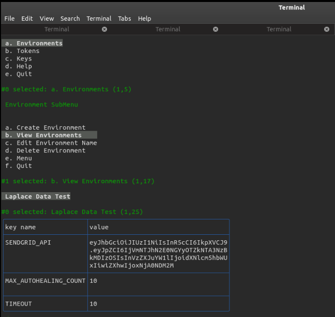

[](https://moleculer.services)

# cdEnv
This is a [Moleculer](https://moleculer.services/)-based microservices project. cdEnv is an environment management system hosted on the cloud used for seemless delivery of personalized environment across all production or test servers. 
You have the ability to store environment variables for different server without having to manually redeploy the instance or change individually. cdEnv has no frontend web interface. It depends on its terminal based [client Library](https://github.com/teezzan/cdEnv-client) for interacting with its services.





## cdEnv Client Library
cdEnv-client comes packaged with a cli application to help ease setting up of environments. You can 
- Signup as a User
- Login as a User
- Create environments and populate it with Keys and values
- View environmental Keys and Variables.
- Modify and delete environments.
- Generate and Revoke access tokens.
- and many more using only the terminal interface.

### Installation

Use the package manager [npm](https://www.npmjs.com/get-npm) to install cdEnv-client.

```bash
npm install --save cdenv
```
After this, you're set and ready to go.


## Usage
Start the project with `npm run dev` command. 
After starting, open the http://localhost:3000/ URL in your browser. 
On the welcome page you can view API Gateway and check the nodes & services.


## Services
- **api**: API Gateway services with load balancer.
- **user**: Service with user based Auth actions.
- **notification**: Service responsible for notification(email sending)  actions.
- **env**: Service responsible for management of environments and their key-value data.


## Useful links
* Moleculer website: https://moleculer.services/
* Moleculer Documentation: https://moleculer.services/docs/0.14/

## NPM scripts

- `npm run dev`: Start development mode (load all services locally with hot-reload & REPL)
- `npm run start`: Start production mode (set `SERVICES` env variable to load certain services)
- `npm run dc:up`: Start the stack with Docker Compose
- `npm run dc:down`: Stop the stack with Docker Compose
