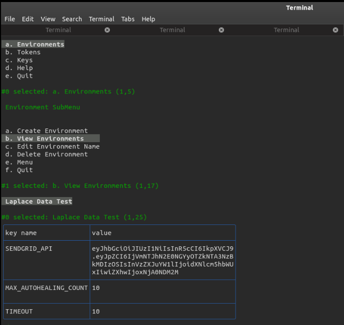

# cdEnv

## Securely store and access API tokens, passwords, encryption keys and other things as environment variables via CLI or HTTP API.

**cdEnv** is a self-hostable and secured system for storing keys and variables for different environments and projects. It allows easy access via HTTP API and CLI.

Having various development environments on different platforms and you needing to update their keys and variables one by one could be a chore. **cdEnv** allows you to have complete control over your data and help serve it across the different environments, local or in the cloud.

[](https://github.com/teezzan/cdenv/blob/master/LICENSE)
[](https://moleculer.services)

## Screenshots/Demo



## Built With

- [Nodejs](https://nodejs.org/en/)
- [MoleculerJS](https://moleculer.services/docs/0.14/)
- [MongoDB](https://www.mongodb.com/)

## Features

- Light-Weight
- User based Access
- Environment Based Access
- Data is Encrypted at Rest
- Generation and Revoking of access tokens.
- Works anywhere you have internet access.

## Example Code

The variables in an environment can be accessed as a `key:value` pair via an HTTP API request to the hosted app. A [library](https://www.npmjs.com/package/cdenv) was developed to do this and many more. It is as simple as 
```javascript
let cdenv = require('@teehazzan/cdenv');
cdenv.fetch('API-TOKEN-GENERATED-FROM-SERVER','APP-ENVIRONMENT-NAME');

```

## Getting Started

These instructions will get you a copy of the project up and running on your local machine for development and testing purposes. See deployment for notes on how to deploy the project on a live system.

### Prerequisites

- [Git](https://git-scm.com/)
- [Nodejs](https://nodejs.org/en/)
- [npm](https://www.npmjs.com/get-npm) (Usually comes bundled with [Nodejs](https://nodejs.org/en/))
- [MongoDB](https://www.mongodb.com/) or [MongoDB Atlas](https://www.mongodb.com/cloud/atlas)

If you prefer Docker for live deployment, [Docker](https://www.docker.com/get-started) is important.

### Installation

To get started, you would need to create a local copy (clone) of the code on your machine. This is done by executing 
```bash
git clone https://github.com/teezzan/cdEnv
```
Next is to enter the directory and install the required library. This can be done by the following.
```bash 
cd cdEnv
npm install
```
Make a copy of the `.env.copy` file, rename it as `.env` and populate it appropriately.


**NOTE:** 

`MAIL_USER` and `MAIL_PASS` are the username and password of a gmail account used to send confirmaation emails.
If `SEND_CONFIRMATION_MAIL` is set to false, you don't have to populate `MAIL_USER` and `MAIL_PASS`.

Start the project with `npm run dev` command. 
You should find the user interface at http://localhost:3000/ URL in your browser. 

### NPM scripts

- `npm run dev`: Start development mode (load all services locally with hot-reload & REPL)
- `npm run start`: Start production mode (set `SERVICES` env variable to load certain services)

### Useful links
* Moleculer website: https://moleculer.services/
* Moleculer Documentation: https://moleculer.services/docs/0.14/


## API Reference/Documentation

>Depending on the size of the project, if it is small and simple enough the reference docs can be added to the `README`. For medium size to larger projects it is important to at least provide a link to where the API reference docs live.


## Deployment

To deploy on a live system, ensure you have [Docker](https://www.docker.com/get-started) installed. Ensure you have copied and edited the `.env` file appropriately. Run
```bash
docker run --env-file .env  teehazzan/cdenv
```


## Contributing

Issues and pull requests are welcome at [cdEnv](https://github.com/teezzan/cdEnv). This project is intended to be safe, welcoming, and open for collaboration. Users are expected to adhere to the [Contributor Covenant code of conduct](https://www.contributor-covenant.org/version/2/0/code_of_conduct/). We are all human.

## Authors

**[Taiwo Yusuf](https://github.com/teezzan/)**


## Acknowledgments

>- Hat tip to anyone whose code was used
>- Inspiration
>- Anything else that seems useful

## License
This project is licensed under the MIT License - see the [LICENSE.md](LICENSE.md) file for details.

